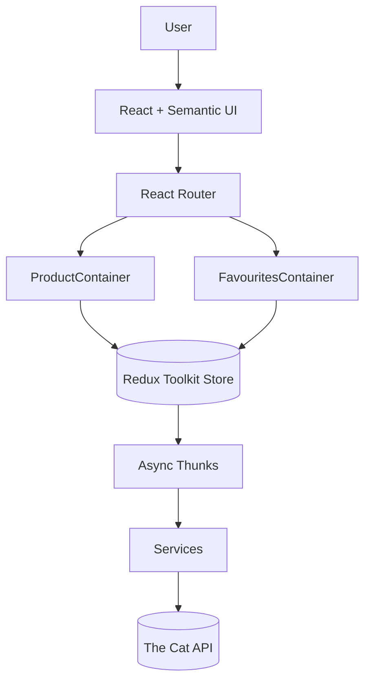
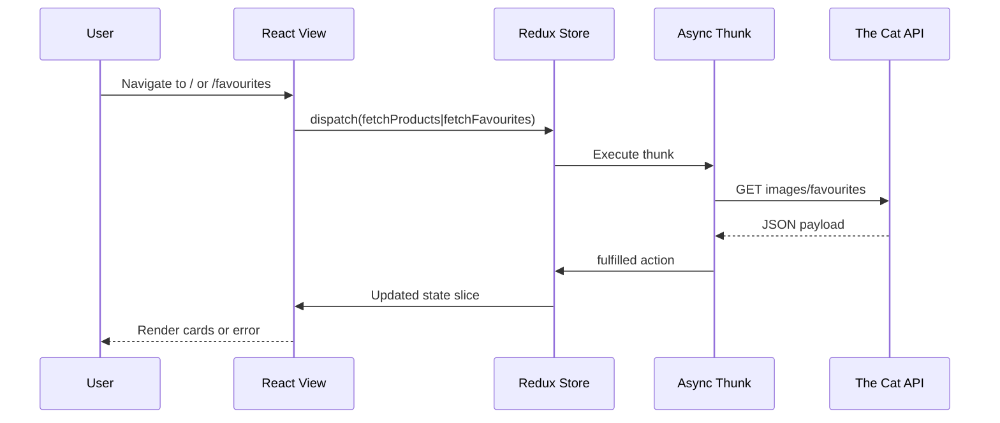

# Cat Gallery + Favourites Viewer

React Router + Redux Toolkit で構成された単一ページアプリです。The Cat API から猫カードを取得し、一覧とお気に入り (/favourites) の 2 画面でブラウズ体験と状態管理の実装力を示すポートフォリオ用途のプロジェクトになっています。

## 目的と見せ場
- **課題**: API 呼び出しがコンポーネントに散在し、エラー/ローディングの制御や API キー管理が煩雑だった
- API/ストアのアーキテクチャを再設計し、共通クライアント・環境変数・型安全なサービス層でこの課題を解消
- Redux Toolkit スライスと AsyncThunk でローディング/エラーを一元管理し、再利用しやすい UI パターンを構築
- Semantic UI React を使ったレスポンシブなカードレイアウトとローディング、エラーメッセージの UX 改善
- TypeScript 全体適用により、API レスポンスとコンポーネント間の型を明確化

## 画面構成
- `/` 猫ギャラリー: 最大 15 枚の画像カードをグリッド表示。初回マウント時に `fetchProducts` thunk が実行されます。
- `/favourites/*` お気に入り: 保存済みの The Cat API favourites を取得し、カードで表示します。
- 共通ヘッダー/フッター: ナビゲーション、検索 UI、外部リンクなどを Semantic UI コンポーネントで提供。

## アーキテクチャ


### データ取得シーケンス


## Tech Highlights
- **React 18 + TypeScript**: 型安全な UI 実装
- **Redux Toolkit + AsyncThunk**: スライスごとに非同期フローを定義し、ローディング・成功・失敗を一元管理することで UI 側は状態マシンとして利用可能
- **Semantic UI React**: レイアウトとアクセシビリティを簡潔に実装
- **Cat API クライアント**: `catApiRequest` が API キー、クエリ結合、エラー処理を共通化

## セットアップ
1. 依存関係  
   ```bash
   npm install
   ```
2. 環境変数  
   `.env.example` を `.env` にコピーし、The Cat API で取得したキーを設定します。
   ```
   REACT_APP_CAT_API_BASE_URL=https://api.thecatapi.com/v1
   REACT_APP_CAT_API_KEY=your_api_key
   ```
3. 開発サーバー  
   ```bash
   npm start
   ```
   ブラウザで http://localhost:3000
4. テスト  
   ```bash
   npm test
   ```
5. ビルド  
   ```bash
   npm run build
   ```
   `build/` に成果物が生成されます。

## デプロイ
Firebase Hosting を想定しています。GitHub main/master にマージ後、CI で `npm run build` → `firebase deploy` を行う構成を利用できます。

## 今後の拡張ToDo
- 無限スクロールやフィルタリングでユーザー操作の幅を拡大
- お気に入り登録・解除 API を追加し、サーバーとの双方向同期を実装
- RTK Query やキャッシュレイヤー導入でデータ取得を高度化
- Lighthouse を用いたアクセシビリティ検証
